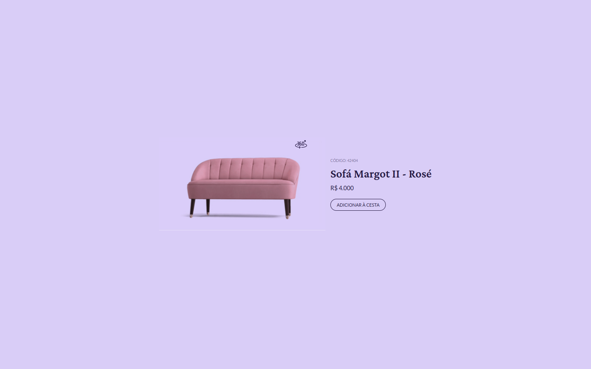

# Boracodar desafio 02 - Card de Produto

Um site que demonstra um produto que pode conter uma visualização do mesmo em 360 graus

## Stack utilizada

**Front-end:** HTML, CSS, Javascript.

**Outros:** Figma, Git e Github.

## Funcionalidades

- Visualizalção da imagem em 360 graus.

## Aprendizados

- Realizar a troca da URL de uma imagem utilizando javascript.

## Referência

- [Canal Rocketseat](https://www.youtube.com/rocketseat)
- [Boracodar.dev](https://www.rocketseat.com.br/boracodar)
