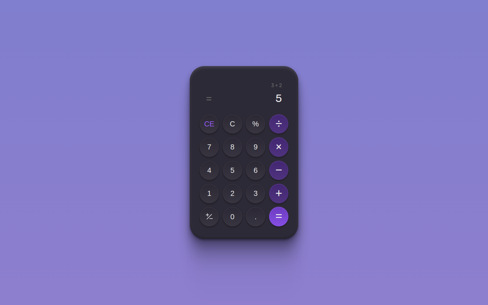

# Boracodar desafio 05 - Calculadora

Uma calculadora utilizando javascript

## Stack utilizada

**Front-end:** HTML, CSS, Javascript.

**Outros:** Figma, Git e Github.

## Funcionalidades

- Realizar cálculos matemáticos.

## Aprendizados

- Utilizar repeat com display do tipo grid;
- Uso da função eval() em javascript.

## Referência

- [Canal Rocketseat](https://www.youtube.com/rocketseat)
- [Boracodar.dev](https://www.rocketseat.com.br/boracodar)
