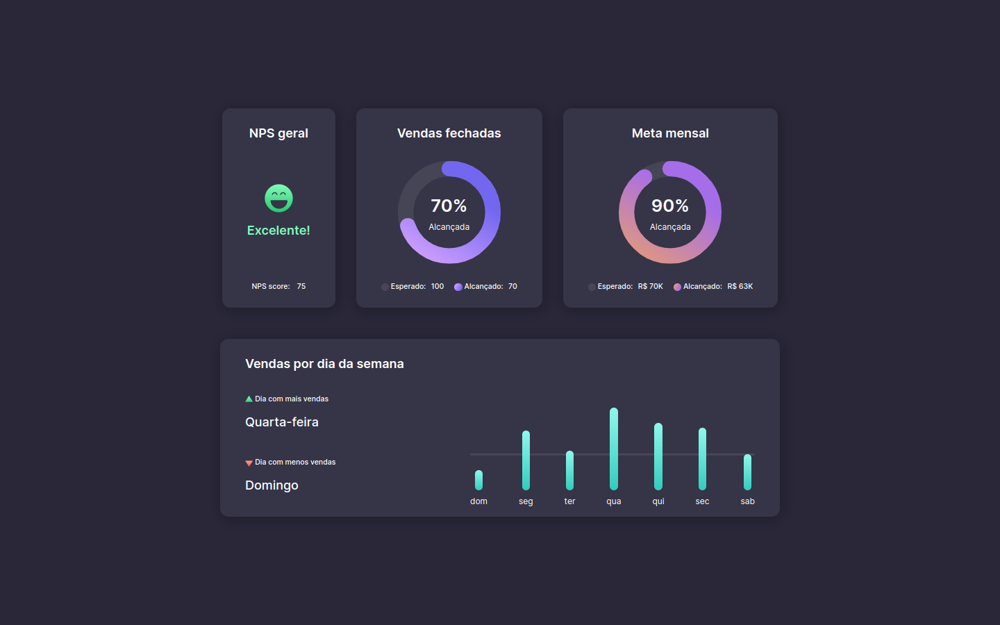

# Boracodar desafio 08 - Dashboard

Um template de dashboard utilizando svgs animados

## Stack utilizada

**Front-end:** HTML, CSS.

**Outros:** Figma, Git e Github.

## Funcionalidades

- Visualizalção de gráficos em formato rosquinha e gráficos de formato barra.

## Aprendizados

- Estilização e animação de svgs;
- Fazer um gráfico de barras sem usar frameworks.

## Referência

- [Canal Rocketseat](https://www.youtube.com/rocketseat)
- [Boracodar.dev](https://www.rocketseat.com.br/boracodar)
