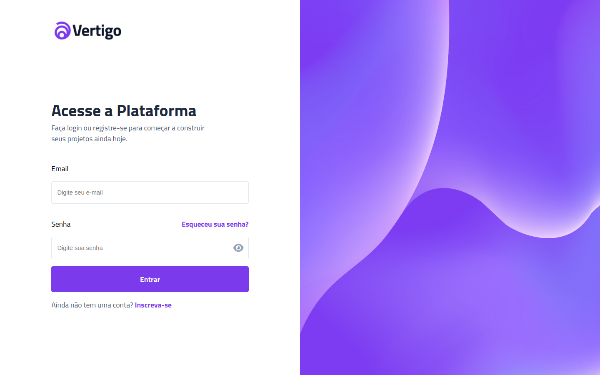

# Boracodar desafio 11 - Tela de login

Um template de tela de login utilizando html, css e um pouco de javascript

## Stack utilizada

**Front-end:** HTML, CSS, Javascript.

**Outros:** Figma, Git e Github.

## Funcionalidades

- in working ...

## Aprendizados

- Utilizar input labels;
- Alternação entre input password e input text.

## Referência

- [Canal Rocketseat](https://www.youtube.com/rocketseat)
- [Boracodar.dev](https://www.rocketseat.com.br/boracodar)
