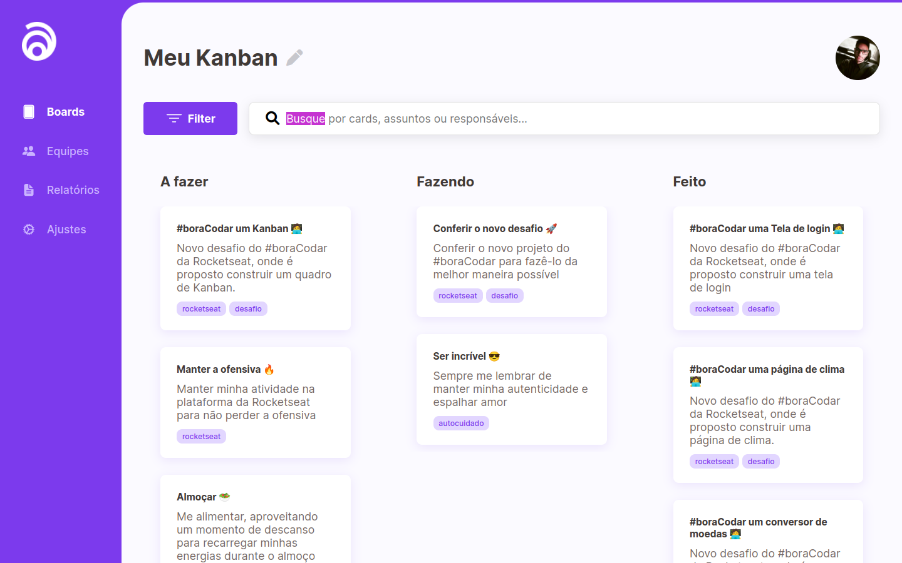

# Boracodar desafio 12 - Kanban

Um site de kanban, para organização de tarefas diárias

## Stack utilizada

**Front-end:** HTML e CSS.

**Outros:** Figma, Git e Github.

## Funcionalidades

- In working...

## Aprendizados

- Melhor utilização de tags semânticas.

## Referência

- [Canal Rocketseat](https://www.youtube.com/rocketseat)
- [Boracodar.dev](https://www.rocketseat.com.br/boracodar)
