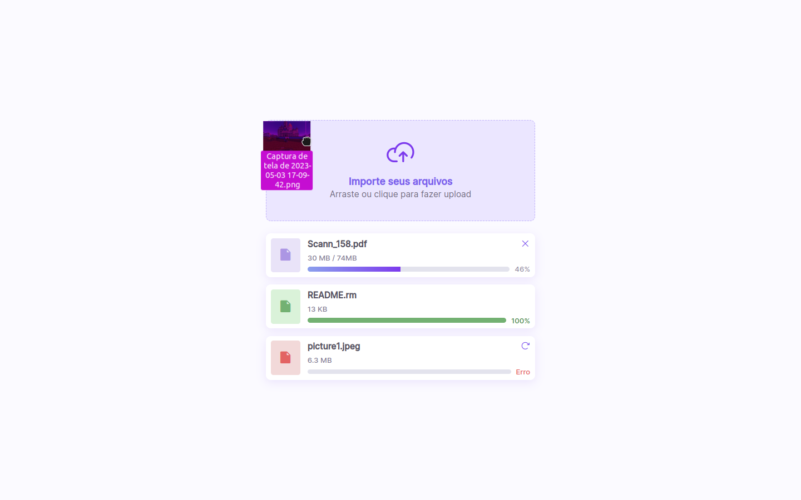

# Boracodar desafio 14 - Componente de Upload

Um componente para fazer uploads de arquivos

## Stack utilizada

**Front-end:** HTML, CSS, Javascript.

**Outros:** Figma, Git e Github.

## Funcionalidades

- in working ...

## Aprendizados

- Identificar se um arquivo está acima de um componente da página;
- Uso da tag progress

## Referência

- [Canal Rocketseat](https://www.youtube.com/rocketseat)
- [Boracodar.dev](https://www.rocketseat.com.br/boracodar)
