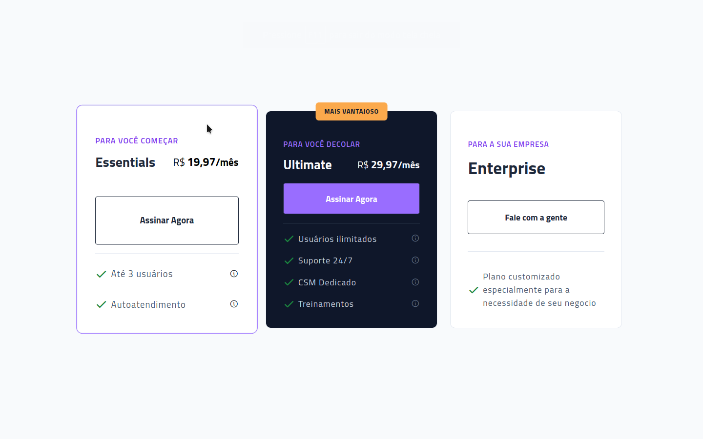

# Boracodar desafio 15 - Pricing Table

Um site que mostra diferentes planos para que o cliente possa adquiri-los

## Stack utilizada

**Front-end:** HTML, CSS, Javascript.

**Outros:** Figma, Git e Github.

## Funcionalidades

- Visualizalção cards de planos.

## Aprendizados

- Animações com css;
- Uso de classes utilitárias e variáveis em css.

## Referência

- [Canal Rocketseat](https://www.youtube.com/rocketseat)
- [Boracodar.dev](https://www.rocketseat.com.br/boracodar)
