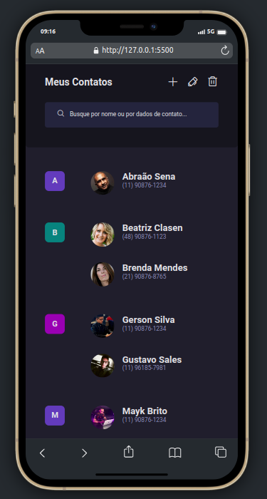

# Boracodar desafio 16 - Página de contatos

Um site que demonstra um produto que pode conter uma visualização do mesmo em 360 graus

## Stack utilizada

**Front-end:** HTML e CSS.

**Outros:** Figma, Git e Github.

## Funcionalidades

- Visualização de contatos.

## Aprendizados

- Estilação de uma barra de scrol.

## Referência

- [Canal Rocketseat](https://www.youtube.com/rocketseat)
- [Boracodar.dev](https://www.rocketseat.com.br/boracodar)
