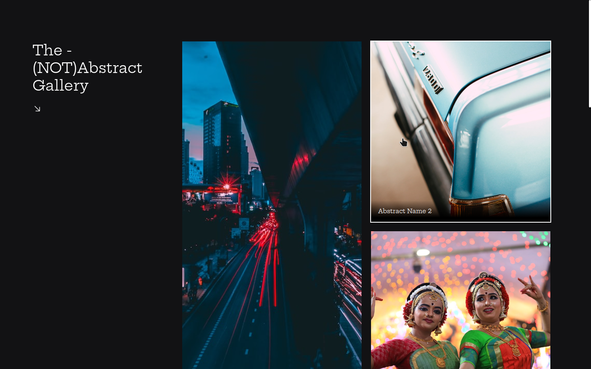

# Boracodar desafio 20 - Galeria de Fotos

Um galeria de fotos online

## Stack utilizada

**Front-end:** HTML, CSS.

**Outros:** Figma, Git e Github.

## Funcionalidades

- Visualização de imagens com displays diferentes.

## Aprendizados

- Visualização de imagens com display grid;
- Funcionalidade de loading em imagens;
- Estilização de hover. 

## Referência

- [Canal Rocketseat](https://www.youtube.com/rocketseat)
- [Boracodar.dev](https://www.rocketseat.com.br/boracodar)
