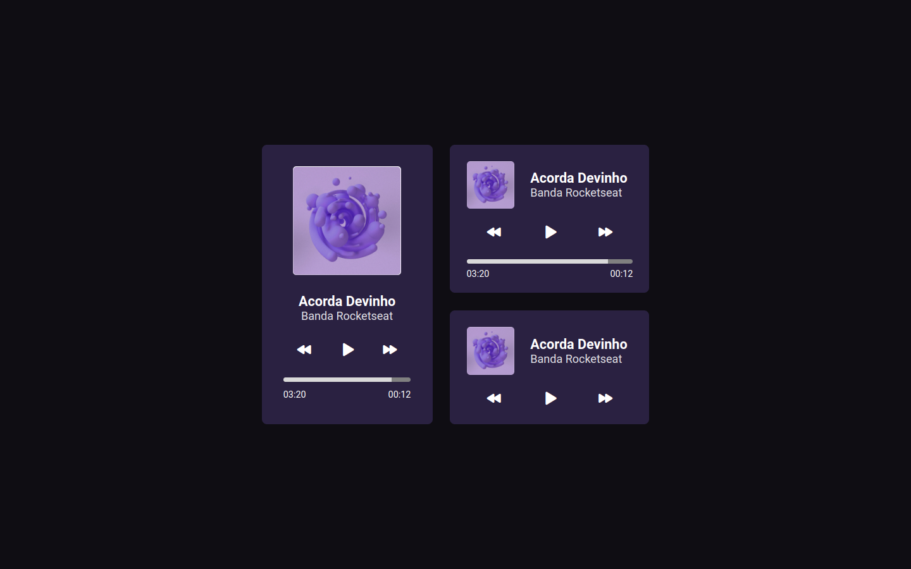

# Boracodar desafio 01 - Player de Música

Um site que demonstra três variações para players de música.

## Stack utilizada

**Front-end:** HTML, CSS, Javascript.

**Outros:** Figma, Git e Github.

## Funcionalidades

- in working...

## Aprendizados

- Uso do display grid.

## Referência

- [Canal Rocketseat](https://www.youtube.com/rocketseat)
- [Boracodar.dev](https://www.rocketseat.com.br/boracodar)
