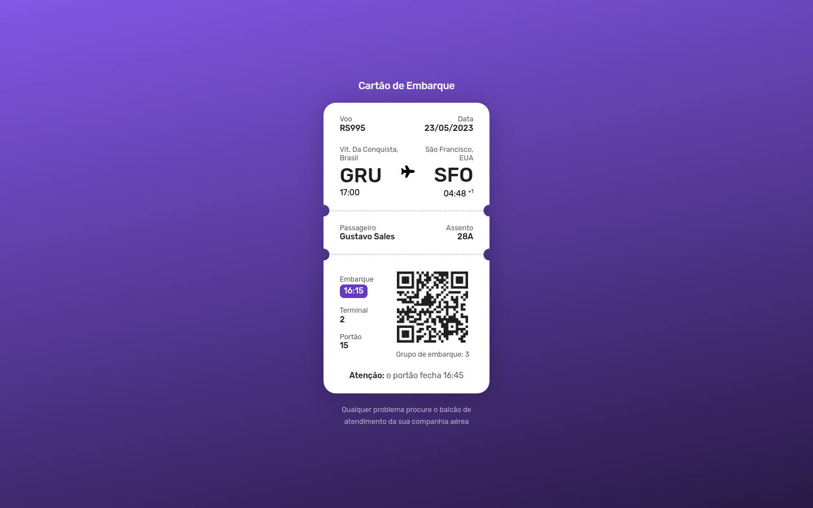

# Boracodar desafio 06 - Cartão de Embarque

Um exemplo de cartão de embarque feito com html e css

## Stack utilizada

**Front-end:** HTML, CSS.

**Outros:** Figma, Git e Github.

## Funcionalidades

- Visualizalção de um cartão de embarque.

## Aprendizados

- Utilizar Mask em css.
- Border com estilo dashed.

## Referência

- [Canal Rocketseat](https://www.youtube.com/rocketseat)
- [Boracodar.dev](https://www.rocketseat.com.br/boracodar)
