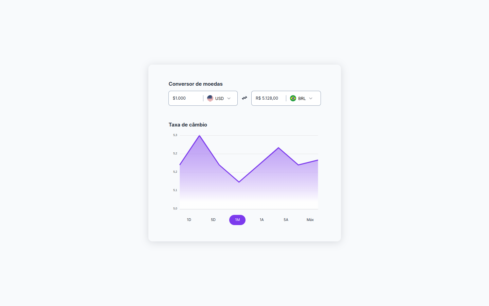

# Boracodar desafio 09 - Conversor de moedas

Um site para realizar a conversão de moedas internacionais

## Stack utilizada

**Front-end:** HTML, CSS e ApexCharts.

**Outros:** Figma, Git e Github.

## Funcionalidades

- In working...

## Aprendizados

- Uso de um framework para a construção de gráficos.

## Referência

- [Canal Rocketseat](https://www.youtube.com/rocketseat)
- [Boracodar.dev](https://www.rocketseat.com.br/boracodar)
