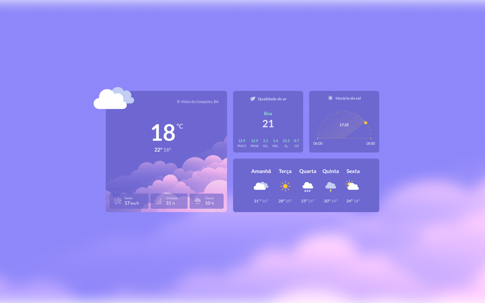

# Boracodar desafio 10 - Página de clima

Um site mostra informações sobre clima de uma cidade

## Stack utilizada

**Front-end:** HTML e CSS.

**Outros:** Figma, Git e Github.

## Funcionalidades

- in working...

## Aprendizados

- Uso de um background image;
- Animação de svgs.

## Referência

- [Canal Rocketseat](https://www.youtube.com/rocketseat)
- [Boracodar.dev](https://www.rocketseat.com.br/boracodar)
