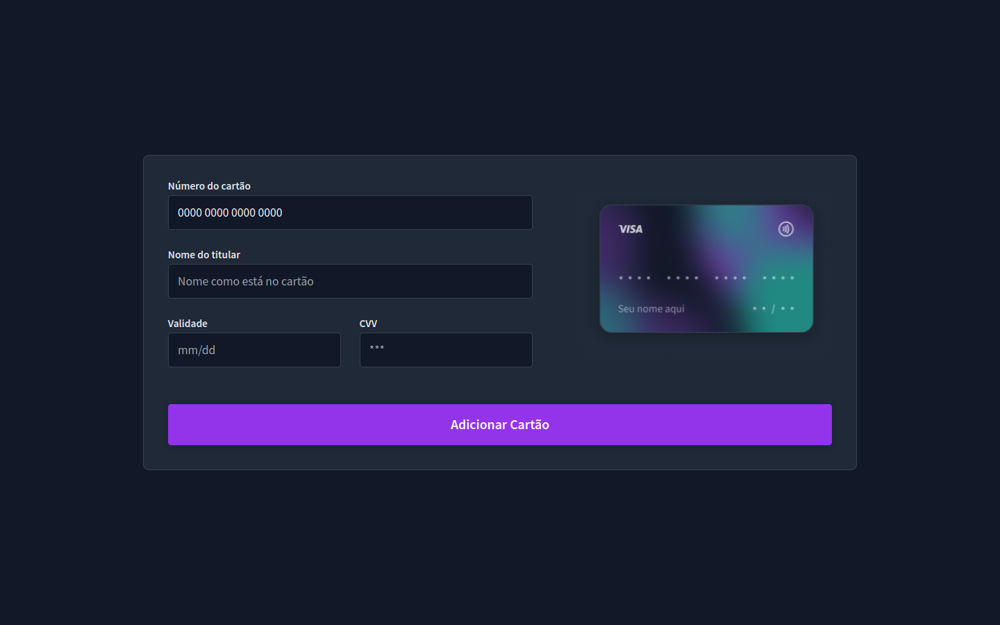

# Boracodar desafio 13 - Formulário de cartão de crédito

Um site para fazer o cadastro de um cartão de crédito

## Stack utilizada

**Front-end:** HTML, CSS, Javascript.

**Outros:** Figma, Git e Github.

## Funcionalidades

- Validação de inputs.

## Aprendizados

- Usar uma máscara para os inputs.

## Referência

- [Canal Rocketseat](https://www.youtube.com/rocketseat)
- [Boracodar.dev](https://www.rocketseat.com.br/boracodar)
