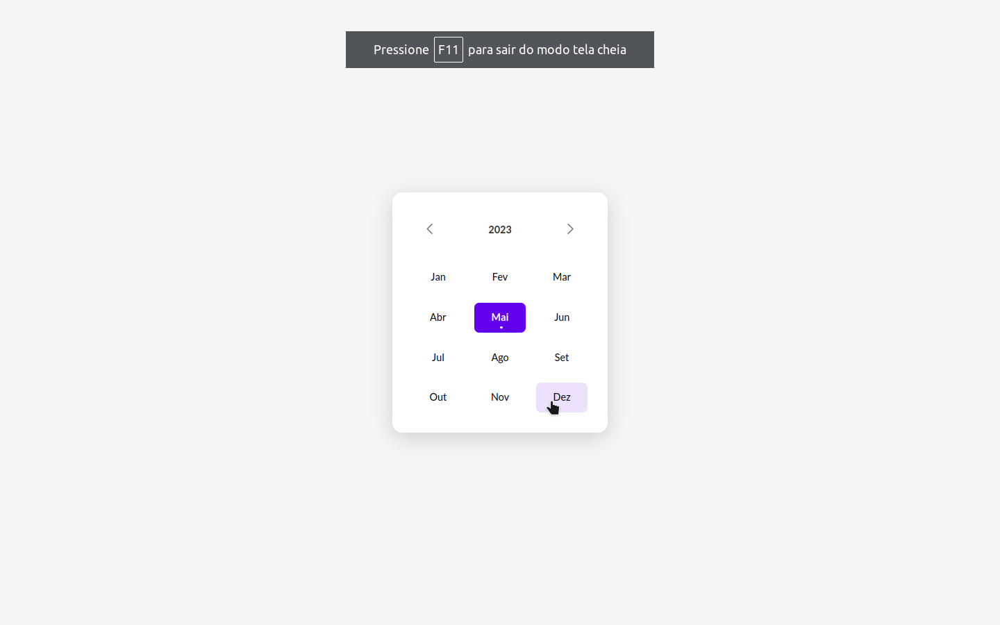

# Boracodar desafio 17 - Data picker

Um site que possibilita escolher datas

## Stack utilizada

**Front-end:** HTML, CSS, Javascript.

**Outros:** Figma, Git e Github.

## Funcionalidades

- in working.

## Aprendizados

- Contruções de elementos HTML utilizando Javascript.

## Referência

- [Canal Rocketseat](https://www.youtube.com/rocketseat)
- [Boracodar.dev](https://www.rocketseat.com.br/boracodar)
