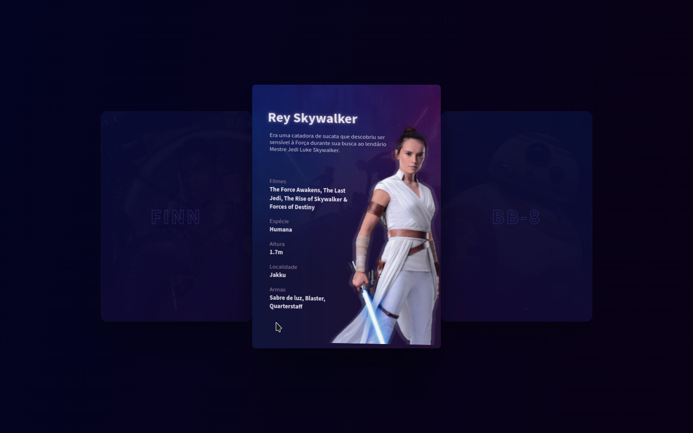

# Boracodar desafio 18 - Start Wars Day

Um site que possibilita a visualização de personagens da saga star wars

## Stack utilizada

**Front-end:** HTML, CSS, Javascript e Atropols.

**Outros:** Figma, Git e Github.

## Funcionalidades

- Visualição das caracteristicas de personagens.

## Aprendizados

- Utilizar biblioteca de animação 3d com javascript.

## Referência

- [Canal Rocketseat](https://www.youtube.com/rocketseat)
- [Boracodar.dev](https://www.rocketseat.com.br/boracodar)
