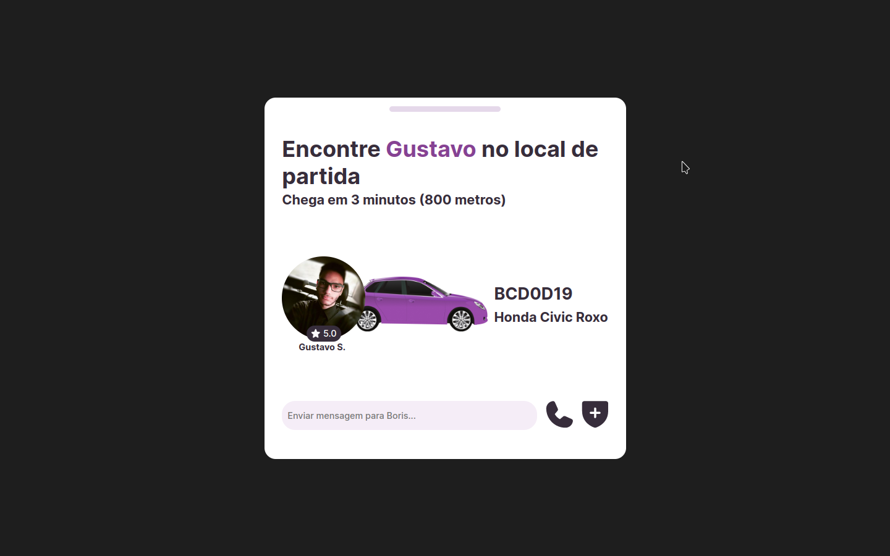

# Boracodar desafio 19 - Widget de Transporte

Um site que demonstra card de motorista de aplicativo

## Stack utilizada

**Front-end:** HTML, CSS, Javascript.

**Outros:** Figma, Git e Github.

## Funcionalidades

- Visualização de um card de um motorista.

## Aprendizados

- Posicionamento de imagens utilizando position absolute e position relative.

## Referência

- [Canal Rocketseat](https://www.youtube.com/rocketseat)
- [Boracodar.dev](https://www.rocketseat.com.br/boracodar)
