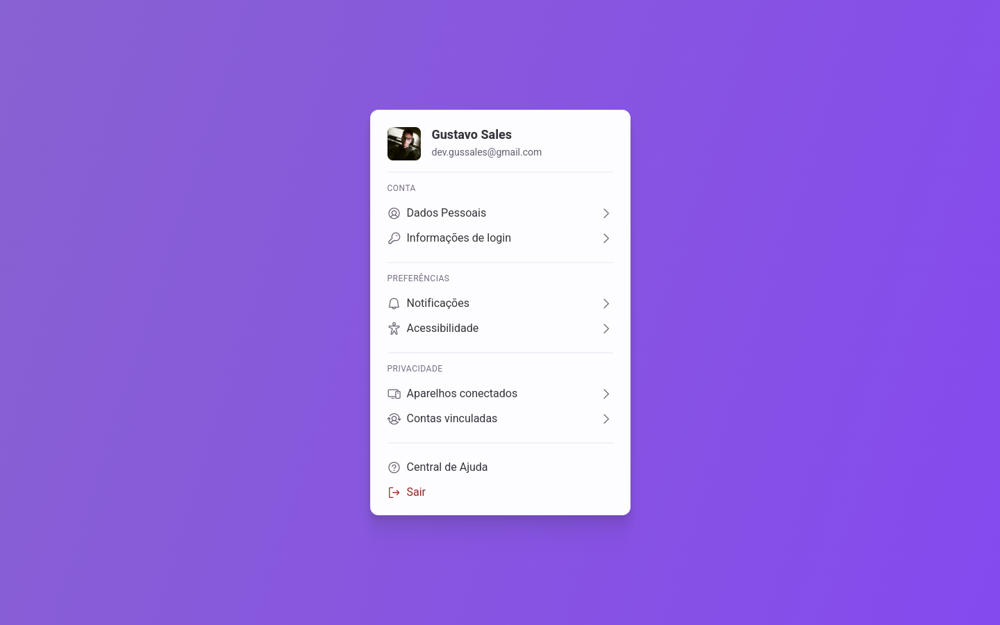

# Boracodar desafio 22 - Profile Settings

Um site para realizar mudanças de configurações do perfil do usuário

## Stack utilizada

**Front-end:** HTML, CSS.

**Outros:** Figma, Git e Github.

## Funcionalidades

- Criação de um layout responsivo.

## Aprendizados

- Uso de SVG do Phosphor icons;

## Referência

- [Canal Rocketseat](https://www.youtube.com/rocketseat)
- [Boracodar.dev](https://www.rocketseat.com.br/boracodar)
