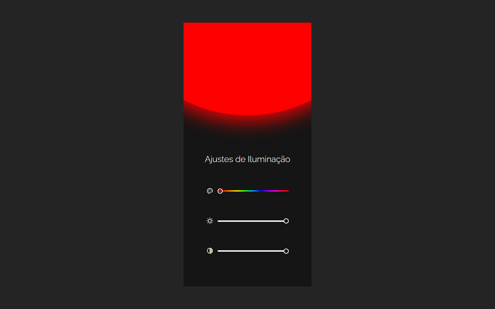

# Boracodar desafio 23 - Ajustes de cor

Um site para escolha de cor com possibilidade de ajustes de brilho e contraste

## Stack utilizada

**Front-end:** HTML, CSS, Javascript.

**Outros:** Figma, Git e Github.

## Funcionalidades

- Escolha de cor via input range;
- Edição da cor como nível de contraste e brilho.

## Aprendizados

- Manipulação da DOM;

## Referência

- [Canal Rocketseat](https://www.youtube.com/rocketseat)
- [Boracodar.dev](https://www.rocketseat.com.br/boracodar)
